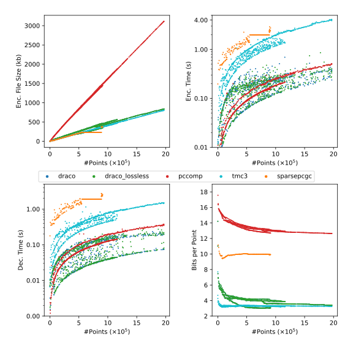

# pc-compression
Evaluation of point cloud geometry compression algorithms on sparse and non-uniform data.

## Abstract
Point clouds are a key element of various robotics applications. As point clouds typically grow in size, the efficient transmission of point clouds is a necessary step in many of these applications ($QUELLEN). Therefore, point cloud, or in general, geometric compression algorithms are employed to reduce transmission size and time.
Sparse point clouds with non-uniformly spaced points have so far been overlooked in the literature.
In this study, we therefore evaluated current state-of-the-art compression algorithms on the FIN dataset, which includes sparse and non-uniform point clouds of four indoor scenes.
For google draco, mpeg-pcc-tmc3 (tmc3 for short), pccomp, and sparsePCGC, we calculate a structural similary metric (PSSIM), bits per point(bpp), and track the processing times (encoding, decoding, and total).

In terms of processing time and similarity score, the python implementation of `pccomp` seems to be the best choice with unter 500ns per point. However, the compression ratio may explain the excellent similarity score, being almost 14bpp while the dataset average is at around 40bpp. With average 3-4bpp, Algorithms like `draco` and `tmc3` performed better in terms of compression rate, though `tmc3` needs considerably more processing time than `draco`.
Overall, including the usability and ease of setup, we determine draco to be the best-performing compression algorithm on sparse and non-uniform data, such as the FIN dataset. 

## Quick Overview
The results below were generated using `draco`, `mpeg-pcc-tmc3`, `sparsepcgc`, and `pccomp`. We used the [FIN Dataset](https://github.com/lupeterm/FIN-Dataset) which includes 4 scenes of an hallway, an office, a conference room, and the main lecture hall.
To calculate the similarity score, we used [PointSSIM](#structural-similarity-metric). The remaining metrics were obtained through a python script during the experiment.

<!-- Below the plot the  hallway results separetely from the others because  -->
| <center>Similarity Scores <br>  all scenes, no sparsePCGC  </center> | <center>Compression rates & Processing times </center>                              |
| -------------------------------------------------------------------- | ----------------------------------------------------------------- |
|                         |  |

For the experiment itself, the default values of each respective algorithm was used, assuming the default is considered lossless. If not, we additionally performed an experiment in lossless mode. 
Furthermore, for the experiments ran on tmc3 and sparsePCGC, an 100x-1000x upscaling of the scenes were necessary. In the case of tmc, we had to set `--inputScale=100` and `--outputUnitLength=100`. For sparsePCGC, we manually added the scaling during the data loading stage using open3d: `pcd = pcd.scale(100, center=pcd.get_center())`. This is because the FIN dataset is a lot smaller compared to the MPEG Ford dataset, the dataset used during evaluation of tmc3 and sparsePCGC. 
The scaling operations (encoding and decoding) are included in the processing times. Arguably, the scaling time could be subtracted from the total time, but since this operation is not optional (for our dataset), we choose to include it. 
As a result of the scaling procedure of sparsePCGC, our GPU seemed to run out of memory which prevented us from reliably performing experiments on scenes larger than 600k points. Because this proved incredibly impractical for our evaluation, we chose to limit the evaluation of sparsePCGC on the hallway scene. The collected data is still enough to determine a trend, especially in comparison with the other algorithms. 

Below are the average results for all algorithms. It is important to note that the average bpp of sparsePCGC are the smallest in that table. However the significance is considerably low, as we only used the hallway scene for the evaluation of sparsePCGG, which is the smallest of the four.

| Algorithm                                           | Avg. PSSIM | Avg. bpp | Avg. Encoding Time/point | Avg. Decoding Time/point | Avg. Total Proc. Time |
| --------------------------------------------------- | ---------- | -------- | ------------------------ | ------------------------ | --------------------- |
| **Draco (default)**                                 | 0.903      | 4.025    | 396ns                    | 220ns                    | 617ns                 |
| **Draco (lossless)**                                | 0.903      | 4.025    | 480ns                    | 309ns                    | 789ns                 |
| **pccomp (default, lossless)**                      | **0.997**  | 13.54    | **281ns**                | **173ns**                | **454ns**             |
| **tmc3 (default, lossless)**                        | 0.882      | **3.31** | 1925ns                   | 938ns                    | 2863ns                |
| **sparcePCGC<br>(hallway only, default, lossless)** | 0.885      | 9.86     | 6238ns                   | 5780ns                   | 12017ns               |

## Rationale
In many real world robotics scenarios, point cloud geometries need to be exchanged between nodes in a system, e.g. ROS, LCM, or ZeroMQ. For instance, one of these nodes could be a Raspberry Pi that computes an unorganized point cloud (UPC) from a continuous stream of RGB-D data. Now, as this point cloud would be processed in in nodes further downstream inside the system, the entire UPC would have to be transmitted over a shared network between the nodes. 
Usually, the size of the point clouds grows quickly as the camera continues to perceive its surroundings. Furthermore, since bandwidth is often limited and expensive, geometric compression algorithms are necessary to ensure the application runs smoothly.

Compression of (point cloud) geometries has been extensively studied. A survey of relevant and recent literature concluded, that most publications evaluated their algorithms using very dense datasets in which the data points are uniformly placed, e.g. [8iVFB](#8iVFB-dataset). Conversely, a publication dedicated to the effective usage of compression algorithms on rather sparse and non-uniform geometries seems to be missing. 


| 2S3DS dataset                                                                                                                                             | FIN dataset                                                                                                                                                                                            |
| --------------------------------------------------------------------------------------------------------------------------------------------------------- | ------------------------------------------------------------------------------------------------------------------------------------------------------------------------------------------------------ |
|                                                                                                                                 |                                                                                                                                                                              |
| For instance, the `auditorium_1` scene of the 2D3DS dataset not only has a medium density, it is also very uniform (see the histogram on the right side). | In contrast, the `auditorium` scene in our self-recorded FIN dataset has an overall lower density _and_ the individual points are non-uniformly placed, as shown by the wider spread in the histogram. |

As the raw amount of data in dense clouds is likely to be greater than its sparse counterpart, the analyses regarding processing time are naturally applicable. 
However, other factors may have been disregarded due to the focus on dense geometries. For instance, the amount of compression-induced information loss may play a different role when the data points are not spaced very close together. 
A lossy approach may even be favorable. Moreover, the underlying techniques predominantly used for dense geometries could show a different usefulness when applied to sparse ones.

The overarching idea of this project is to quantify the usage of geometric compression algorithms on sparse point clouds, thus evaluating
- to which extent results of previous publications on dense data can generally be applied to sparse data,
- which (classes of) algorithms are most suitable,
- how useful *lossless* compression is in the context of sparse geometries, and
- if it is not sufficiently useful, at which point is it a valuable tradeoff?  

While outdoor or urban datasets are also valid, for the sake of setup simplicity, and because point density decreases quadratically with sensor distance ([Hackel et. al.](#fast-semantic-segmentation)), we will focus on indoor point clouds in this study.
For the concrete evaluation metrics, we will measure  
1. the encoding and decoding processing times,
2. compression ratios using `bpp` (bits per point), and finally,
3. to measure the reconstruction quality, we can
   1. a resolution adaptive PSNR (RA-PSNR) ([Javaheri et. al](#improved-psnr)), and
   2. a structural similarity score (PointSSIM) ([Alexiou et. al](#structural-similarity-metric))

However, as both quality metrics have been evaluated on the same dataset using Mean opinion scores, and because PointSSIM has the greater average performance, we choose not to calculate RA-PSNR (see Figures below). Additionally, the source code for PointSSIM has been published by the authors, while an implementation of RA-PSNR would have been necessary.

| PointSSIM                      | RA-PSNR                       |
| ------------------------------ | ----------------------------- |
|  |  |

Lastly, as this study does not focuses on external factors like available bandwidth, we will perform the evaluation with independence of aforementioned messaging libraries.
The next section presents a roadmap for the project including milestones and some additional technical information(datasets, algorithms, evaluation setup).

Note: PointSSIM can determine the similarity of point clouds based on up to four options; geometry, normals, curvature, and color. Since this project is focused on sparse geometries, we will therefore limit the similarity to the geometric similarity alone.  

## Roadmap

1. Literature Review
   1. Algorithm qualifier
      1. Algorithm "Archetypes", e.g. 1D traversal, 2D mapping etc.
      2. amount of loss
      3. underlying technique
      4. type of input
      5. type of output
      6. (language/ needs (re-)implementation)
      7. Deterministic (?)
   2. Algorithms (see [table](#algorithm-qualifiers))
      1.  [ ] [D-PCC](#d-pcc)
      2.  [x] [Google Draco](#google-draco)
      3.  [x] [pccomp_oct](#pccomp-oct)
      4.  [x] [mpeg-pcc-tmc13](#mpeg-pcc-tmc13)
      5.  [ ] [SparsePCGC](#sparsepcgc)
      6.  [ ] ~~[Unicorn](#unicorn)~~
      7.  [ ] ~~MPEG Anchor~~
      8.  [ ] [DEPOCO](#depoco)
   3. Datasets
      1. Qualifiers
         1. Size
         2. Dynamic/Static
         3. Type of scenes
            1. Indoor/outdoor
            2. Synthetic / Realistic
         4. File format:
            1. most algorithms support the PLY format
      2. Datasets
         1. FIN Dataset
            > Maybe record more scenes.
   4. Metrics
      1. Processing Time Enc/Dec
      2. Quality:
         1. ~~Adaptive Peak to Signal and Noise ratio, see [Javaheri et. al](#improved-psnr)~~ overall slightly worse than 2.
         2. Point cloud similarity methods, e.g. [structural similarity metric](#structural-similarity-metric) (bonus points for working on .ply files)
         3. ~~root mean square error (RMSE)~~ is the most basic PSNR calculation
      3. Compression Effectiveness:
         1. Compression ratio (bits per point)
2. Experimental Setup
   1. Overall setup: Python scripts 
   2. Used file format: PLY
      1. Would have to convert from pcd to PLY first using a simple [open3d script](https://www.open3d.org/docs/0.9.0/tutorial/Basic/file_io.html#file-io)
      2. data points will be float64 (see the open3d [docs](https://www.open3d.org/docs/latest/python_api/open3d.geometry.PointCloud.html#open3d.geometry.PointCloud.points))
   3. Calculate the aforementioned metrics of 1.4
3. Evaluate
   > Gather all metrics and present them nicely using matplot or seaborn

### Exclusions

#### DPCC
No pretrained models have been published. Furthermore, the dependencies are severely outdated (python 3.7 has been EOL since june '23) or simply not installable for similar reasons.

#### SparsePCGC
While the models have been published along with all necessary training and testing data, the dependencies (pytorch 1.10 and MinkowskiEngine 0.5) are, again, not installable as of February 2025 on Ubuntu 24.04.

#### DEPOCO
The same problem with pytorch seems to apply for DEPOCO as well.
### Algorithm Qualifiers
| **Paper / Name**                                                 | **Source**                                                                                                   | **AI ?**  | ~~ROS compatible?~~ | avg bpp                    | runtime enc/dec | loss?               | used datasets                   | Cloud Format                                         |
| ---------------------------------------------------------------- | ------------------------------------------------------------------------------------------------------------ | --------- | ------------------- | -------------------------- | --------------- | ------------------- | ------------------------------- | ---------------------------------------------------- |
| Density-preserving Deep Point Cloud Compression                  | [https://github.com/yunhe20/D-PCC](https://github.com/yunhe20/D-PCC)                                         | x         |                     | max. 6bpp                  | 80ms/30ms       | lossy?              | kitty, ShapeNet                 | PLY, XYZ or BIN (tho their prep script is necessary) |
| Google Draco                                                     | [https://github.com/google/draco](https://github.com/google/draco)                                           | -         | ~~x~~               |                            | ~1/~0.5         | both                | example meshes                  | PLY, OBJ, STL (Could theoretically extend)           |
| Octree-based lossy point-cloud compression with open3d and numpy | [https://github.com/szppaks/pccomp_oct](https://github.com/szppaks/pccomp_oct)                               | -         | ~~x~~               |                            | ?               | ?                   | none                            | PLY, XYZ, PTS, PCD                                   |
| mpeg-pcc-tmc13                                                   | [https://github.com/MPEGGroup/mpeg-pcc-tmc13](https://github.com/MPEGGroup/mpeg-pcc-tmc13)                   | ?         |                     |                            | ?               | ?                   | ?                               | (only?) PLY                                          |
| SparsePCGC, lossless                                             | [https://github.com/NJUVISION/SparsePCGC](https://github.com/NJUVISION/SparsePCGC)                           | x         | ~~?~~               | 13.5bpp                    | 2.22/206        | no                  | kitti, ford                     | PLY, H5, BIn                                         |
| SparsePCGC, lossy                                                | [https://github.com/NJUVISION/SparsePCGC](https://github.com/NJUVISION/SparsePCGC)                           | x         | ~~?~~               |                            | 1.5/1.12        | yes                 | kitti, ford                     | PLY, H5, BIn                                         |
| ~~Unicorn~~    This might just be SparsePCGC                     | ~~[https://njuvision.github.io/Unicorn/](https://njuvision.github.io/Unicorn/)~~                             | ~x~       | ~~?~~               | ~~s: 12bpp , k+f: 4-5bpp~~ | ~~~5/~5~~       | ~~lossless~~        | ~~kitti, ford, scannet~~        | ?                                                    |
| ~~MPEG Anchor~~                                                  | 404                                                                                                          | ~~mixed~~ | ~~?~~               | ~~?~~                      | ~~0.8s-1s ?~~   | ?                   | ~~some form of kinect dataset~~ | ~~?~~                                                |
| Deep Compression for Dense Point Cloud Maps (DEPOCO)             | [https://github.com/PRBonn/deep-point-map-compression](https://github.com/PRBonn/deep-point-map-compression) | x         |                     | 0.44 looks good apparently | ?               | lossy, idk how much | kitti, nuScenes                 | i assume kitty, hard to tell tbqh                    |

For more info, see below.

## References
### Algorithms
#### Google Draco
> [Source](https://github.com/google/draco)

```
https://opensource.googleblog.com/2017/01/introducing-draco-compression-for-3d.**html**
```

#### PCCOMP-OCT
>[Source](https://github.com/szppaks/pccomp_oct)
```
Original article: Szutor Péter: Ipari pontfelhők tömörítése,  
Dr. Balázs Boglárka (szerk.) Az elmélet és a gyakorlat találkozása a térinformatikában VIII. Theory meets practice in GIS Debrecen, Magyarország  
Debreceni Egyetemi Kiadó, (2017) pp. 349-355
```
#### mpeg-pcc-tmc13
[Source](https://github.com/MPEGGroup/mpeg-pcc-tmc13)
```
Original Publication: some collection of ISO standarts
```
once i figure out how to use it, that is
#### SparsePCGC
> [Source](https://github.com/NJUVISION/SparsePCGC)
```
@article{Ding_Li_Feng_Cao_Ma_2022, 
   title={Sparse Tensor-based Multiscale Representation for Point Cloud Geometry Compression}, 
   url={http://arxiv.org/abs/2111.10633}, 
   DOI={10.48550/arXiv.2111.10633}, 
   publisher={arXiv}, 
   author={Ding, Dandan and Li, Zhu and Feng, Xiaoxing and Cao, Chuntong and Ma, Zhan}, 
   year={2022}
}
```
#### D-PCC
> [Source](https://github.com/yunhe20/D-PCC)
```
@InProceedings{He_2022_CVPR,
    author    = {He, Yun and Ren, Xinlin and Tang, Danhang and Zhang, Yinda and Xue, Xiangyang and Fu, Yanwei},
    title     = {Density-preserving Deep Point Cloud Compression},
    booktitle = {Proceedings of the IEEE/CVF Conference on Computer Vision and Pattern Recognition (CVPR)},
    year      = {2022}
}
```
#### Unicorn
> [Source](https://njuvision.github.io/Unicorn/)

> Unicorn seems to be just a different name for [SparsePCGC](#sparsepcgc). We will not (try to) use it. 
```
@ARTICLE{10682571,
  author={Wang, Jianqiang and Xue, Ruixiang and Li, Jiaxin and Ding, Dandan and Lin, Yi and Ma, Zhan},
  title={A Versatile Point Cloud Compressor Using Universal Multiscale Conditional Coding – Part I: Geometry}, 
  journal={IEEE Transactions on Pattern Analysis and Machine Intelligence}, 
  year={2025},
  volume={47},
  number={1},
  doi={10.1109/TPAMI.2024.3462938}
}

and 

@ARTICLE{10682566,
  author={Wang, Jianqiang and Xue, Ruixiang and Li, Jiaxin and Ding, Dandan and Lin, Yi and Ma, Zhan},
  title={A Versatile Point Cloud Compressor Using Universal Multiscale Conditional Coding – Part II: Attribute}, 
  journal={IEEE Transactions on Pattern Analysis and Machine Intelligence}, 
  year={2025},
  volume={47},
  number={1},
  doi={10.1109/TPAMI.2024.3462945}
}


```
#### DEPOCO
> [Source] (https://github.com/PRBonn/deep-point-map-compression)

>  This software seems to rely heavily on nvidia GPUs, which might prove difficult to use.
```
@article{wiesmann2021ral,
   author = {L. Wiesmann and A. Milioto and X. Chen and C. Stachniss and J. Behley},
   title = {{Deep Compression for Dense Point Cloud Maps}},
   journal = {IEEE Robotics and Automation Letters (RA-L)},
   volume = 6,
   issue = 2,
   pages = {2060-2067},
   doi = {10.1109/LRA.2021.3059633},
   year = 2021
}
```

---
### Datasets
#### 8iVFB
> [Source](http://plenodb.jpeg.org/pc/8ilabs)
```
Maja Krivokuća, Philip A. Chou, and Patrick Savill, “8i Voxelized Surface Light Field (8iVSLF) Dataset,” ISO/IEC JTC1/SC29 WG11 (MPEG) input document m42914, Ljubljana, July 2018.
```

### Misc
#### Fast Semantic Segmentation
```
@article{Hackel_Wegner_Schindler_2016, 
   title={FAST SEMANTIC SEGMENTATION OF 3D POINT CLOUDS WITH STRONGLY VARYING DENSITY}, 
   volume={III–3}, 
   ISSN={2194-9050}, 
   DOI={10.5194/isprsannals-III-3-177-2016}, 
   publisher={ISPRS},
   journal={Annals of Photogrammetry, Remote Sensing and Spatial Information Sciences}, 
   author={Hackel, Timo and Wegner, Jan D. and Schindler, Konrad}, 
   year={2016} 
}
```

#### Improved PSNR
```
@inproceedings{Javaheri_2020,
   title={Improving Psnr-Based Quality Metrics Performance For Point Cloud Geometry},
   url={http://dx.doi.org/10.1109/ICIP40778.2020.9191233},
   DOI={10.1109/icip40778.2020.9191233},
   booktitle={2020 IEEE International Conference on Image Processing (ICIP)},
   publisher={IEEE},
   author={Javaheri, Alireza and Brites, Catarina and Pereira, Fernando and Ascenso, Joao},
   year={2020},
   month=oct 
}
```

#### Structural Similarity Metric
```
@INPROCEEDINGS{9106005,
  author={Alexiou, Evangelos and Ebrahimi, Touradj},
  booktitle={2020 IEEE International Conference on Multimedia & Expo Workshops (ICMEW)}, 
  title={Towards a Point Cloud Structural Similarity Metric}, 
  year={2020},
  volume={},
  number={},
  pages={1-6},
  keywords={Point cloud compression;Geometry;Visualization;Three-dimensional displays;Image color analysis;Predictive models;Feature extraction;Point cloud;objective quality metric;visual quality assessment},
  doi={10.1109/ICMEW46912.2020.9106005}}

```
